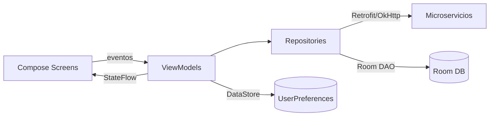

# Rentify (App móvil Android)

Aplicación móvil construida con **Kotlin + Jetpack Compose** para un flujo de arriendo digital. La app implementa navegación con Compose, manejo de estado con ViewModels (StateFlow), persistencia local con Room y consumo de microservicios vía Retrofit/OkHttp.

---

## Funcionalidades principales

- **Autenticación**: login y registro (con validaciones de email/RUT/teléfono/contraseña).
- **Roles**: experiencia diferenciada para **Arrendatario**, **Propietario** y **Administrador**.
- **Catálogo de propiedades**: listado, filtros y priorización por cercanía (si se concede ubicación).
- **Detalle de propiedad**: información enriquecida y flujo para **crear solicitud de arriendo**.
- **Solicitudes**: vista y gestión multi-rol (ver/crear/aprobar/rechazar según rol).
- **Documentos**: carga/listado para usuario y gestión por admin (cambio de estado).
- **Panel de administración**: gestión de usuarios/propiedades/documentos.
- **Contacto**: envío y administración de mensajes.
- **Reseñas**: endpoints y repositorio para reseñas/valoraciones (integración con Review Service).

---

## Stack tecnológico

**Android**
- Kotlin (Gradle Kotlin DSL)
- Jetpack Compose + Material 3
- Navigation Compose
- Lifecycle ViewModel + collectAsStateWithLifecycle
- Coroutines

**Datos y red**
- Room (con KSP para el compiler)
- DataStore (Preferences) para sesión de usuario
- Retrofit + OkHttp + Gson (con interceptor de logging)
- Coil (carga de imágenes)

**Servicios del dispositivo**
- Ubicación: Google Play Services Location
- Cámara + FileProvider (captura/selección y cache local)
- Network Security Config habilitado para HTTP en desarrollo

### Versiones relevantes (según Gradle)

- Android Gradle Plugin: 8.13.1
- Gradle Wrapper: 8.13
- Kotlin: 2.0.21
- Compose BOM: 2024.09.00
- compileSdk / targetSdk: 36
- minSdk: 24
- Room: 2.6.1 (KSP para `room-compiler`)
- Navigation Compose: 2.9.5

### Testing

- Unit tests: JUnit 4
- Mocks: Mockito / Mockito-Kotlin
- Coroutines Test

---

## Arquitectura (visión general)

El proyecto sigue un enfoque **MVVM + Repository**:

- **UI (Compose)**: pantallas y componentes reaccionan a `StateFlow`.
- **ViewModels**: coordinan estado/validaciones y llaman a repositorios.
- **Repositorios**:
  - *Remotos* (Retrofit) para microservicios.
  - *Locales* (Room/DAO) para cache/datos maestros y fallback offline.
- **Persistencia de sesión**: DataStore guarda `userId`, `userRole`, etc.



---

## Estructura del proyecto

Repositorio:
- `README.md` (este archivo)
- `Rentify/` proyecto Android (Gradle)

Dentro de `Rentify/app/src/main/java/com/example/rentify/`:
- `MainActivity.kt`: punto de entrada Compose, creación de DB, repositorios y ViewModels.
- `navigation/`: `AppNavGraph`, `AppDrawer`, `Routes`.
- `ui/`
  - `screen/`: pantallas Compose (Login, Register, Catálogo, Detalle, etc).
  - `viewmodel/`: ViewModels + factories.
  - `components/`: componentes reutilizables (TopBar, cards, chips, etc).
  - `theme/`: tema Material 3.
- `data/`
  - `remote/`: `RetrofitClient`, DTOs y APIs.
  - `repository/`: repositorios remotos/locales.
  - `local/`: Room (`database/`, `dao/`, `entities/`) + `storage/` (DataStore).
- `domain/validation/`: validadores reutilizables (email/RUT/teléfono/contraseña, etc).

---

## Navegación (mapa de pantallas)

La navegación se define en `AppNavGraph` usando `NavHost` y rutas declaradas en `Routes`.

```mermaid
flowchart TD
  W[welcome] --> L[login]
  W --> R[register]
  L --> H[home]
  R --> L

  H --> C[catalogo_propiedades]
  C --> D[propiedad_detalle/{propiedadId}]
  D --> S[solicitudes]
  S --> SD[solicitud_detalle/{solicitudId}]

  H --> P[perfil]
  P --> MD[mis_documentos]
  P --> S

  H --> AP[admin_panel]
  AP --> GU[gestion_usuarios]
  AP --> GP[gestion_propiedades]
  AP --> GD[gestion_documentos]

  H --> CT[contact]
```

---

## Backend / Microservicios

La app consume microservicios por puertos (configurados en `RetrofitClient`):

- User Service: `8081`
- Property Service: `8082`
- Document Service: `8083`
- Application Service: `8084`
- Contact Service: `8085`
- Review Service: `8086`

### Configurar IP (muy importante)

El `baseUrl` usa una IP local (LAN) para desarrollo. Si ejecutas en emulador, normalmente necesitas:

- **Emulador Android**: `10.0.2.2`
- **Dispositivo físico**: IP de tu PC/servidor en la misma red

La app permite HTTP en desarrollo mediante `network_security_config.xml` y `usesCleartextTraffic=true`.

---

## Persistencia local (Room)

- Base de datos: `RentifyDatabase` (Room).
- Estrategia de migración: `fallbackToDestructiveMigration()` (en desarrollo recrea la BD si cambia el esquema).
- Poblado inicial: se insertan catálogos (roles/estados/regiones/comunas/tipos/categorías/tipos de documentos/tipos de reseña) y datos de prueba.

### Usuarios de prueba (solo desarrollo)

La base local se puebla con usuarios ejemplo (p.ej. Admin/Propietario/Arrendatario). Úsalos únicamente para pruebas en entorno local.

---

## Permisos y capacidades

Declarados en el `AndroidManifest.xml`:

- `INTERNET` (consumo de APIs)
- `ACCESS_FINE_LOCATION` / `ACCESS_COARSE_LOCATION` (propiedades cercanas)
- `CAMERA` (captura de imágenes)

Además:
- `FileProvider` para compartir URIs de imágenes (cache interno `cache/images/`).

---

## Requisitos para desarrollo

- Android Studio (recomendado)
- JDK 11 (el proyecto compila con target JVM 11)
- Gradle Wrapper (incluido)
- Emulador Android o dispositivo físico

---

## Ejecutar la app

1. Abrir la carpeta `Rentify/` en Android Studio.
2. Sincronizar Gradle.
3. Configurar backend (microservicios) y ajustar IP si aplica.
4. Ejecutar en emulador/dispositivo.

---

## Comandos útiles (Gradle)

Desde la carpeta `Rentify/`:

```bash
# Windows (PowerShell)
.\gradlew.bat test
.\gradlew.bat :app:assembleDebug
```

```bash
# macOS/Linux
./gradlew test
./gradlew :app:assembleDebug
```

---

## Atajos recomendados (Android Studio)

- Buscar acción: `Ctrl+Shift+A`
- Buscar en todo el proyecto: `Double Shift`
- Ir a archivo/clase: `Ctrl+N` / `Ctrl+Shift+N`
- Reformat: `Ctrl+Alt+L`
- Organizar imports: `Ctrl+Alt+O`

---

## Troubleshooting

- **No conecta al backend**: revisa IP/puertos y que el dispositivo esté en la misma red.
- **Emulador**: usa `10.0.2.2` para alcanzar tu localhost.
- **HTTP bloqueado**: la app habilita cleartext en desarrollo, pero si cambias dominios/IPs verifica `network_security_config.xml`.
- **Ubicación**: si el usuario deniega permisos, la app debe cargar propiedades sin priorizar cercanía.
